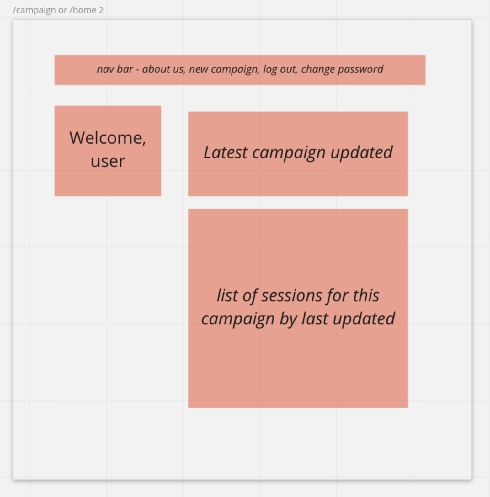

## Roll4Iinitiative Client

Welcome! This is the API for the Roll4Iinitiative application.

Users can create an account and add new campaigns and entries for your campaigns to track their progress.

## Roll4 Api
[link to API](https://github.com/cmd08010/roll4-api)

### Users

### User Stories

- As a user I want to sign in/up
- As a user I want to change my password
- As a user I want to sign out
- As a user I want to Create a new Campaign
- As a user I want to Read multiple Campaigns
- As a user I want to Read a single Campaign
- As a user I want to Update a Campaign I own
- As a user I want to Delete a Campaign I own
- As a user I want to Create a new Session in a campaign
- As a user I want to Read multiple Sessions
- As a user I want to Read a single Session
- As a user I want to Update a Session I own
- As a user I want to Delete a Session I own

## Planning Stories

I wanted to create an application that could help me keep track of Dungeons and Dragons Campaigns as they are run. This application allows you to create campaigns and create sessions for each campaign. I began with Trello and some wireframes and an ERD for planning purposes. I then designed and completed the entire api and then completed the front end.

### Technologies Used:

* jQuery
* HTML/CSS
* Bootstrap
* Javascript
* Moment.js Package
* Express
* Passport for authentication

### Wireframes

## Unsolved Problems

I would like the future versions to have a cleaner UI and UX. I also want to ensure it is mobile friendly. I will also be adding an additional forgot password feature and the ability to add members to a campaign so you can share with your friends! I also want to add a notes page to include notes about the campaign. I also want to add preloadable campaigns for users to use.
